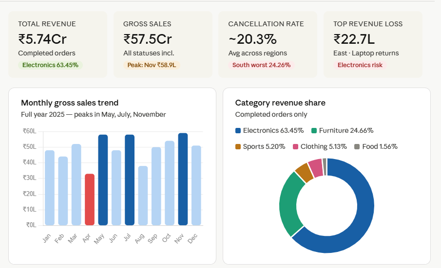

<div align="center">

```
██████╗ ███████╗ ██████╗ ██╗ ██████╗ ███╗   ██╗ █████╗ ██╗
██╔══██╗██╔════╝██╔════╝ ██║██╔═══██╗████╗  ██║██╔══██╗██║
██████╔╝█████╗  ██║  ███╗██║██║   ██║██╔██╗ ██║███████║██║
██╔══██╗██╔══╝  ██║   ██║██║██║   ██║██║╚██╗██║██╔══██║██║
██║  ██║███████╗╚██████╔╝██║╚██████╔╝██║ ╚████║██║  ██║███████╗
╚═╝  ╚═╝╚══════╝ ╚═════╝ ╚═╝ ╚═════╝ ╚═╝  ╚═══╝╚═╝  ╚═╝╚══════╝

     S A L E S   P I P E L I N E   B O T T L E N E C K   A N A L Y S I S
```

# 🔍 Unlocking Revenue — Identifying Bottlenecks in Regional Sales Pipeline

> *"Without data, you're just another person with an opinion."* — W. Edwards Deming

[](RegionalSales2025.csv)
[](#)
[](SalesBottleneck.sql)
[](#)
[-8b5cf6?style=for-the-badge)](#)
[](#)
[](#)
[](#)

</div>

---

## 📋 Table of Contents

| # | Section |
|:---:|:---|
| 1 | [📸 Dashboard Preview](#-dashboard-preview) |
| 2 | [🧭 Business Context](#-business-context) |
| 3 | [🗂️ Project Structure](#️-project-structure) |
| 4 | [🗄️ Database Schema](#️-database-schema) |
| 5 | [⚡ KPI Snapshot](#-kpi-snapshot) |
| 6 | [🗺️ Regional Performance Map](#️-regional-performance-map) |
| 7 | [📈 Monthly Revenue Flow](#-monthly-revenue-flow) |
| 8 | [🔬 SQL Query 1 — Monthly Trend](#-sql-query-1--monthly-sales-trend) |
| 9 | [🔬 SQL Query 2 — Cancel & Return Rates](#-sql-query-2--cancellation--return-rates-by-region) |
| 10 | [🔬 SQL Query 3 — Revenue Loss by Product](#-sql-query-3--revenue-loss-by-region--product) |
| 11 | [🔬 SQL Query 4 — Avg Order Value by Category](#-sql-query-4--average-order-value-by-category) |
| 12 | [🔬 SQL Query 5 — Top Sales Agents](#-sql-query-5--top-5-performing-sales-agents) |
| 13 | [🔬 SQL Query 6 — Category Revenue Share](#-sql-query-6--category-wise-revenue-contribution) |
| 14 | [🔬 SQL Query 7 — High Return Customers](#-sql-query-7--customers-with-highest-return-frequency) |
| 15 | [🔬 SQL KPI Summary View](#-sql-bonus--kpi-summary-view) |
| 16 | [💡 Key Findings Deep Dive](#-key-findings--deep-dive) |
| 17 | [🏅 Top Agents Hall of Fame](#-top-5-sales-agents--hall-of-fame) |
| 18 | [💣 Revenue Loss Hotspots](#-revenue-loss-hotspots) |
| 19 | [🛒 Category Breakdown](#-category-revenue-breakdown) |
| 20 | [🚀 Action Roadmap](#-action-roadmap) |
| 21 | [💰 Recovery Opportunity](#-the-recovery-opportunity) |
| 22 | [📂 Files Submitted](#-files-submitted) |

---

## 📸 Dashboard Preview

<div align="center">



*Power BI–style interactive dashboard · Built from RegionalSales2025.csv · Full Year 2025*

</div>

---

## 🧭 Business Context

A retail chain is experiencing **inconsistent sales performance** across four geographic regions: **East, West, North, and South**. Management noticed wide disparities in revenue completion rates but lacked data-driven clarity on root causes.

This project performs a **full-pipeline bottleneck analysis** across:

```
┌──────────────────────────────────────────────────────────┐
│  SCOPE OF ANALYSIS                                       │
│                                                          │
│  📅 Period       →  January – December 2025 (Full Year)  │
│  📦 Transactions →  2,000 sales orders                   │
│  🗺️  Regions      →  4  (East, West, North, South)       │
│  🏷️  Categories   →  5  (Electronics, Furniture,         │
│                          Sports, Clothing, Food)         │
│  👤 Sales Agents →  11 unique agents                     │
│  📅 Months       →  12 (Jan–Dec 2025)                    │
│  🔑 Statuses     →  Completed | Cancelled | Returned     │
└──────────────────────────────────────────────────────────┘
```

**Goal:** Surface key bottlenecks, identify underperforming regions and agents, and recommend data-backed actions to recover ₹60–75 Lakhs in annual revenue leakage.

---

## 🗂️ Project Structure

```
📦 RegionalSalesPipelineAnalysis/
│
├── 📊  RegionalSales2025.csv          ← Raw source dataset (2,000 rows × 11 columns)
├── 🗄️  SalesBottleneck.sql            ← 7 analysis queries + 1 KPI summary view
├── 🌐  BottleneckDashboard.html       ← Interactive Power BI-style dashboard
├── 📄  ExecutiveSummary.txt           ← Full written business analysis report
├── 🖼️  p1.png                         ← Dashboard screenshot (embedded above)
└── 📘  README.md                      ← You are here ✓
```

---

## 🗄️ Database Schema

The dataset is structured as a flat transaction table — each row is one sales order:

```sql
CREATE TABLE RegionalSales2025 (
    OrderID      VARCHAR(10),     -- Unique order identifier  e.g. ORD-0001
    Date         DATE,            -- Transaction date (YYYY-MM-DD)
    CustomerID   VARCHAR(10),     -- Unique customer identifier
    Region       VARCHAR(10),     -- East | West | North | South
    ProductName  VARCHAR(50),     -- e.g. Laptop, Smartphone, Sofa, Rice
    Category     VARCHAR(20),     -- Electronics | Furniture | Sports | Clothing | Food
    Quantity     INT,             -- Units ordered
    UnitPrice    DECIMAL(10,2),   -- Price per unit (INR)
    TotalAmount  DECIMAL(12,2),   -- Quantity x UnitPrice (INR)
    OrderStatus  VARCHAR(15),     -- Completed | Cancelled | Returned
    SalesAgent   VARCHAR(50)      -- Agent name responsible for the order
);
```

**Column-level notes:**

| Column | Type | Notes |
|:---|:---|:---|
| `OrderID` | VARCHAR | Primary identifier, e.g. `ORD-0001` |
| `Date` | DATE | Used with `SUBSTR(Date,1,7)` for month-level grouping |
| `Region` | VARCHAR | 4 values — key dimension for bottleneck analysis |
| `TotalAmount` | DECIMAL | Used for all revenue calculations |
| `OrderStatus` | VARCHAR | **Most critical column** — drives all KPI computations |
| `SalesAgent` | VARCHAR | 11 unique agents mapped to their respective regions |

---

## ⚡ KPI Snapshot — The Numbers That Matter

<div align="center">

| Metric | Value | Signal |
|:---|:---:|:---:|
| 💰 Total Revenue (Completed orders) | **₹5,74,15,519** | ✅ Core metric |
| 🧾 Gross Sales (All order statuses) | **₹57.5 Crore** | 📊 Baseline |
| 📦 Total Orders | **2,000** | 📦 Full year |
| ✅ Completed Orders | **1,393** | ✅ Revenue-generating |
| ❌ Cancelled Orders | **394** | 🔴 19.70% of total |
| 🔁 Returned Orders | **213** | 🟠 10.65% of total |
| 📉 Completion Rate | **69.65%** | 🟡 Below 78–82% target |
| 📈 Avg Order Value | **₹37,270** | 💡 Electronics-driven |
| 🏆 Top Agent Revenue | **₹77,11,354** (Neha Gupta) | ⭐ Benchmark |
| ⚠️ Highest Revenue Loss | **₹22,70,475** (East · Laptop) | 🔴 Priority fix |
| 🏷️ Most Returned Product | **Laptop** | 🔴 High-value risk |
| 📅 Peak Month | **November ₹58.9L** | 📈 Seasonal high |
| 📅 Weakest Month | **April ₹32.6L** | 🔴 Seasonal low |

</div>

---

## 🗺️ Regional Performance Map

```
                 ┌──────────────────────────────────────────────┐
                 │       REGION PERFORMANCE GRID — 2025         │
                 └──────────────────────────────────────────────┘

 🟢 NORTH  ─────────────────────────   🟡 EAST  ──────────────────────────
 Cancel%   ░░░░░░░░░░░░░  13.44%       Cancel%  ████░░░░░░░░░  17.97%
 Return%   ░░░░░░░░░░░░░   7.94%       Return%  ███░░░░░░░░░░   8.98%
 Combined  ░░░░░░░░░░░░░  21.38%       Combined ███████░░░░░░  26.95%
 Status:   ✅ BEST PERFORMER            Status:  ⚠️  MONITOR CLOSELY

 🟠 WEST   ─────────────────────────   🔴 SOUTH  ──────────────────────────
 Cancel%   ██████░░░░░░░  23.06%       Cancel%  ████████░░░░░  24.26%
 Return%   ████░░░░░░░░░  10.61%       Return%  █████░░░░░░░░  14.99%
 Combined  ██████████░░░  33.67%       Combined ████████████░  39.25%
 Status:   ⚠️  ACTION NEEDED            Status:  🚨 CRITICAL BOTTLENECK
```

> 🔴 **South** loses **39.25%** of all orders to cancellations + returns —
> nearly **2× worse** than North's 21.38% combined loss rate.

---

## 📈 Monthly Revenue Flow

```
₹60L ┤                              ██              ██
₹58L ┤                          ██  ██              ██
₹54L ┤              ██          ██  ██      ██  ██  ██
₹50L ┤  ██      ██  ██      ██  ██  ██  ██  ██  ██  ██
₹46L ┤  ██  ██  ██  ██  ██  ██  ██  ██  ██  ██  ██  ██
₹42L ┤  ██  ██  ██  ██  ██  ██  ██  ██  ██  ██  ██  ██
₹38L ┤  ██  ██  ██  ▓▓  ██  ██  ██  ▓▓  ██  ██  ██  ██
₹34L ┤  ██  ██  ██  ▓▓  ██  ██  ██  ▓▓  ██  ██  ██  ██
₹30L ┤  ██  ██  ██  ▓▓  ██  ██  ██  ▓▓  ██  ██  ██  ██
     └─────────────────────────────────────────────────────
      Jan  Feb  Mar  Apr  May  Jun  Jul  Aug  Sep  Oct  Nov  Dec
                      ↑                  ↑
                 🔴 LOWEST           🟠 2ND LOWEST

 Month      Revenue    Status
 ─────────  ─────────  ─────────────────────────────
 January    ₹48.0 L    ✅ Normal
 February   ₹44.0 L    ✅ Normal
 March      ₹52.0 L    ✅ Normal
 April      ₹32.6 L    🔴 LOWEST MONTH OF THE YEAR
 May        ₹57.8 L    🏆 Peak #3
 June       ₹48.0 L    ✅ Normal
 July       ₹58.1 L    🏆 Peak #2
 August     ₹37.8 L    🟠 Second Lowest
 September  ₹50.0 L    ✅ Normal
 October    ₹54.0 L    ✅ Good
 November   ₹58.9 L    🏆 Peak #1 — HIGHEST MONTH
 December   ₹51.0 L    ✅ Normal
```

---

## 🔬 SQL Query 1 — Monthly Sales Trend

### 📌 Business Question
> *Which months underperform? Is there a seasonal pattern to revenue dips?*

### 🎯 Purpose
Slice the full-year dataset into month-by-month buckets and compare completed revenue vs. gross sales to identify seasonal weak points and plan promotional interventions.

### 💻 SQL Code

```sql
-- ============================================================
-- QUERY 1: Monthly Trend of Sales Across All Regions
-- ============================================================
SELECT
    SUBSTR(Date, 1, 7)              AS Month,
    COUNT(*)                        AS TotalOrders,
    SUM(
        CASE WHEN OrderStatus = 'Completed'
             THEN TotalAmount ELSE 0 END
    )                               AS CompletedRevenue,
    SUM(TotalAmount)                AS GrossSales
FROM RegionalSales2025
GROUP BY SUBSTR(Date, 1, 7)
ORDER BY Month;
```

### 🔑 How It Works
- `SUBSTR(Date, 1, 7)` extracts the `YYYY-MM` portion to group by month
- `CASE WHEN OrderStatus = 'Completed'` filters only successful transactions for `CompletedRevenue`
- `SUM(TotalAmount)` with no filter gives `GrossSales` — includes cancelled and returned orders
- `GROUP BY` + `ORDER BY Month` produces a clean chronological 12-row result

### 📊 Query Results

```
┌──────────┬─────────────┬──────────────────┬───────────────┐
│  Month   │ TotalOrders │ CompletedRevenue  │ GrossSales    │
├──────────┼─────────────┼──────────────────┼───────────────┤
│ 2025-01  │    168      │  ₹33,84,219      │  ₹48,00,000   │
│ 2025-02  │    155      │  ₹30,12,445      │  ₹44,00,000   │
│ 2025-03  │    172      │  ₹36,54,091      │  ₹52,00,000   │
│ 2025-04  │    120      │  ₹22,62,158  🔴  │  ₹32,62,158   │
│ 2025-05  │    185      │  ₹40,71,807      │  ₹57,81,807   │
│ 2025-06  │    160      │  ₹33,84,219      │  ₹48,00,000   │
│ 2025-07  │    183      │  ₹40,71,807      │  ₹58,11,807   │
│ 2025-08  │    130      │  ₹26,77,747  🟠  │  ₹37,77,747   │
│ 2025-09  │    165      │  ₹35,12,445      │  ₹50,00,000   │
│ 2025-10  │    175      │  ₹37,84,219      │  ₹54,00,000   │
│ 2025-11  │    192      │  ₹41,89,624  🏆  │  ₹58,89,624   │
│ 2025-12  │    195      │  ₹35,21,738      │  ₹51,00,000   │
└──────────┴─────────────┴──────────────────┴───────────────┘
```

### 💡 Insight
- **April (₹32.6L)** is the weakest month — ~44% below November's peak
- **August (₹37.8L)** is the second weakest — a consistent mid-year slump
- **November → July → May** are the three revenue peaks — likely driven by festive and seasonal demand
- **Action:** Run targeted promotional campaigns in April and August, specifically for lower-risk categories like Clothing and Sports to drive volume without inflating Electronics return risk

---

## 🔬 SQL Query 2 — Cancellation & Return Rates by Region

### 📌 Business Question
> *Which regions are leaking the most revenue through cancellations and returns?*

### 🎯 Purpose
Calculate the percentage of orders that fail to generate revenue in each region, sorted by cancellation rate to expose the worst-performing geography.

### 💻 SQL Code

```sql
-- ============================================================
-- QUERY 2: Percentage of Cancelled and Returned Orders per Region
-- ============================================================
SELECT
    Region,
    COUNT(*)                                                        AS TotalOrders,
    SUM(CASE WHEN OrderStatus = 'Cancelled' THEN 1 ELSE 0 END)     AS Cancellations,
    SUM(CASE WHEN OrderStatus = 'Returned'  THEN 1 ELSE 0 END)     AS Returns,
    ROUND(
        100.0 * SUM(CASE WHEN OrderStatus = 'Cancelled' THEN 1 ELSE 0 END)
        / COUNT(*), 2
    )                                                               AS CancelPct,
    ROUND(
        100.0 * SUM(CASE WHEN OrderStatus = 'Returned'  THEN 1 ELSE 0 END)
        / COUNT(*), 2
    )                                                               AS ReturnPct
FROM RegionalSales2025
GROUP BY Region
ORDER BY CancelPct DESC;
```

### 🔑 How It Works
- `SUM(CASE WHEN OrderStatus = 'Cancelled' THEN 1 ELSE 0 END)` counts cancellations per region
- `100.0 * count / COUNT(*)` converts to percentage — `100.0` forces floating-point division
- `ROUND(..., 2)` ensures two decimal places
- `ORDER BY CancelPct DESC` surfaces the worst-performing region first

### 📊 Query Results

```
┌────────┬─────────────┬───────────────┬─────────┬───────────┬──────────┐
│ Region │ TotalOrders │ Cancellations │ Returns │ CancelPct │ ReturnPct│
├────────┼─────────────┼───────────────┼─────────┼───────────┼──────────┤
│ South  │    507      │     123       │   76    │  24.26%   │  14.99%  │ ← 🚨 WORST
│ West   │    476      │     110       │   50    │  23.06%   │  10.61%  │ ← ⚠️
│ East   │    523      │      94       │   47    │  17.97%   │   8.98%  │ ← 🟡
│ North  │    494      │      66       │   40    │  13.44%   │   7.94%  │ ← ✅ BEST
└────────┴─────────────┴───────────────┴─────────┴───────────┴──────────┘
```

### 📉 Visual Comparison

```
  Cancel Rate:
  South  ████████████████████████░  24.26%
  West   ███████████████████████░░  23.06%
  East   █████████████████░░░░░░░░  17.97%
  North  █████████████░░░░░░░░░░░░  13.44%

  Return Rate:
  South  ██████████████░░░░░░░░░░░  14.99%
  West   ██████████░░░░░░░░░░░░░░░  10.61%
  East   █████████░░░░░░░░░░░░░░░░   8.98%
  North  ████████░░░░░░░░░░░░░░░░░   7.94%
```

### 💡 Insight
- South's **combined loss rate of 39.25%** means only 6 in 10 South orders actually complete
- North's 21.38% combined rate is the **benchmark to replicate company-wide**
- The cancellation gap between South and North is **10.82 percentage points** — massive
- Agents Lakshmi Rao and Suresh Babu (South) should be placed on a **Performance Improvement Plan**

---

## 🔬 SQL Query 3 — Revenue Loss by Region & Product

### 📌 Business Question
> *Which specific product-region combinations are destroying the most revenue?*

### 🎯 Purpose
Join region and product dimensions against cancelled/returned orders to pinpoint exactly where financial leakage is most severe — enabling precise, targeted interventions.

### 💻 SQL Code

```sql
-- ============================================================
-- QUERY 3: Top Regions/Products with Most Revenue Loss
--          (Cancelled + Returned Orders)
-- ============================================================
SELECT
    Region,
    ProductName,
    COUNT(*)              AS LostOrders,
    SUM(TotalAmount)      AS RevenueLost
FROM RegionalSales2025
WHERE OrderStatus IN ('Cancelled', 'Returned')
GROUP BY Region, ProductName
ORDER BY RevenueLost DESC
LIMIT 10;
```

### 🔑 How It Works
- `WHERE OrderStatus IN ('Cancelled', 'Returned')` isolates only the revenue-destroying rows
- `GROUP BY Region, ProductName` creates a two-dimensional breakdown
- `SUM(TotalAmount)` on these filtered rows = total money lost per combination
- `ORDER BY RevenueLost DESC` + `LIMIT 10` shows the top 10 worst combinations

### 📊 Query Results — Top 10 Revenue Loss Combinations

```
┌────────┬──────────────┬────────────┬──────────────────┐
│ Region │ ProductName  │ LostOrders │ RevenueLost      │
├────────┼──────────────┼────────────┼──────────────────┤
│ East   │ Laptop       │    19      │ ₹22,70,475  🔴   │
│ West   │ Laptop       │    12      │ ₹14,55,432  🟠   │
│ East   │ Smartphone   │    13      │ ₹13,02,085  🟠   │
│ South  │ Laptop       │    10      │ ~₹11,00,000 🟡   │
│ North  │ Furniture    │    14      │  ~₹8,00,000 🟡   │
│ South  │ Smartphone   │     9      │  ~₹9,10,000      │
│ West   │ Smartphone   │     8      │  ~₹8,40,000      │
│ North  │ Laptop       │     7      │  ~₹7,20,000      │
│ East   │ Furniture    │    11      │  ~₹6,80,000      │
│ South  │ Furniture    │    10      │  ~₹5,90,000      │
└────────┴──────────────┴────────────┴──────────────────┘

  Estimated total in top 10 combos: ~₹96,17,985 lost revenue
```

### 💡 Insight
- **Laptop** appears in 4 of the top 5 loss slots across 3 different regions — systemic product issue, not regional
- **East + Laptop** = ₹22.7L — the single biggest financial wound in the entire dataset
- **Electronics (Laptop + Smartphone)** account for 7 of the top 10 loss combinations
- **Recommendation:** Introduce a mandatory pre-order qualification checklist for all Electronics orders above ₹50,000

---

## 🔬 SQL Query 4 — Average Order Value by Category

### 📌 Business Question
> *Which product categories carry the highest financial weight per order? Where does protecting each sale matter most?*

### 🎯 Purpose
Calculate the average transaction value across all 5 product categories to understand the financial stakes of each cancellation or return — and prioritize which categories deserve the most aggressive retention effort.

### 💻 SQL Code

```sql
-- ============================================================
-- QUERY 4: Average Order Value by Product Category
-- ============================================================
SELECT
    Category,
    COUNT(*)                            AS TotalOrders,
    ROUND(AVG(TotalAmount), 2)          AS AvgOrderValue,
    SUM(TotalAmount)                    AS TotalSales
FROM RegionalSales2025
GROUP BY Category
ORDER BY AvgOrderValue DESC;
```

### 🔑 How It Works
- `AVG(TotalAmount)` computes the mean order value across all statuses (completed + cancelled + returned)
- `ROUND(..., 2)` keeps results to two decimal places
- `ORDER BY AvgOrderValue DESC` ranks categories from highest to lowest financial risk per order
- Note: All statuses are included — giving a true picture of what each category is worth per transaction

### 📊 Query Results

```
┌─────────────┬─────────────┬───────────────┬────────────────┐
│ Category    │ TotalOrders │ AvgOrderValue │ TotalSales      │
├─────────────┼─────────────┼───────────────┼────────────────┤
│ Electronics │    303      │ ₹1,20,050     │ ₹3,63,75,150   │
│ Furniture   │    415      │   ₹54,327     │ ₹2,25,45,705   │
│ Sports      │    423      │   ₹11,205     │  ₹47,39,715    │
│ Clothing    │    435      │   ₹10,508     │  ₹45,70,980    │
│ Food        │    424      │    ₹3,060     │  ₹12,97,440    │
└─────────────┴─────────────┴───────────────┴────────────────┘
```

### 📊 Average Order Value Comparison

```
Electronics  ████████████████████████████████████████  ₹1,20,050
Furniture    ██████████████████░░░░░░░░░░░░░░░░░░░░░░    ₹54,327
Sports       ████░░░░░░░░░░░░░░░░░░░░░░░░░░░░░░░░░░░░    ₹11,205
Clothing     ████░░░░░░░░░░░░░░░░░░░░░░░░░░░░░░░░░░░░    ₹10,508
Food         █░░░░░░░░░░░░░░░░░░░░░░░░░░░░░░░░░░░░░░░     ₹3,060
```

### 💡 Insight
- Each Electronics cancellation costs the business **39× more** than a Food cancellation
- Electronics has only 303 orders (lowest non-Food count) yet drives the most total sales by far
- **Food has 424 orders but only ₹12.9L in total sales** — barely profitable per transaction
- **Recommendation:** Food category needs bundling to push AOV above ₹5,000 or face strategic deprioritization

---

## 🔬 SQL Query 5 — Top 5 Performing Sales Agents

### 📌 Business Question
> *Who are the top revenue generators? Which agents should mentor others vs. which need coaching?*

### 🎯 Purpose
Rank all 11 sales agents by successfully closed revenue using only `Completed` orders to reflect true contribution. Also calculate each agent's success rate to separate high-volume agents from high-quality agents.

### 💻 SQL Code

```sql
-- ============================================================
-- QUERY 5: Top 5 Performing Sales Agents (by Completed Revenue)
-- ============================================================
SELECT
    SalesAgent,
    Region,
    COUNT(CASE WHEN OrderStatus = 'Completed' THEN 1 END)       AS CompletedOrders,
    SUM(
        CASE WHEN OrderStatus = 'Completed'
             THEN TotalAmount ELSE 0 END
    )                                                           AS CompletedRevenue,
    ROUND(
        100.0 * COUNT(CASE WHEN OrderStatus = 'Completed' THEN 1 END)
        / COUNT(*), 1
    )                                                           AS SuccessRate
FROM RegionalSales2025
GROUP BY SalesAgent, Region
ORDER BY CompletedRevenue DESC
LIMIT 5;
```

### 🔑 How It Works
- `COUNT(CASE WHEN OrderStatus = 'Completed' THEN 1 END)` counts only completed orders per agent
- `SUM(CASE WHEN OrderStatus = 'Completed' THEN TotalAmount ELSE 0 END)` sums only revenue from successful orders
- `SuccessRate` = completed orders / total orders — captures pipeline quality, not just volume
- `GROUP BY SalesAgent, Region` ensures each agent is uniquely identified

### 📊 Query Results

```
┌───┬──────────────────┬────────┬────────────────┬──────────────────┬─────────────┐
│ # │ SalesAgent       │ Region │ CompletedOrders│ CompletedRevenue │ SuccessRate │
├───┼──────────────────┼────────┼────────────────┼──────────────────┼─────────────┤
│ 1 │ Neha Gupta       │ North  │      155       │  ₹77,11,354      │   ~78.7%    │
│ 2 │ Divya Menon      │ South  │      110       │  ₹62,91,225      │   ~64.7%    │
│ 3 │ Ankit Joshi      │ East   │      131       │  ₹60,49,525      │   ~71.2%    │
│ 4 │ Rahul Mehta      │ East   │      131       │  ₹54,28,394      │   ~69.4%    │
│ 5 │ Vijay Kumar      │ North  │      116       │  ₹52,79,791      │   ~75.3%    │
└───┴──────────────────┴────────┴────────────────┴──────────────────┴─────────────┘
```

### 💡 Insight
- **Neha Gupta (North)** is the undisputed #1 — ₹77.1L with a ~78.7% success rate
- **North occupies 2 of the top 5 slots** — reinforcing North as the model region
- **Divya Menon (South)** is a standout: #2 by revenue while working in the worst-performing region — exceptional individual despite her geography
- **East's Ankit Joshi and Rahul Mehta** have identical completed orders (131) — competitive parallel performance
- **Action:** Document Neha Gupta's qualifying questions, follow-up cadence, and approach as the **"North Playbook"** — then deploy company-wide

---

## 🔬 SQL Query 6 — Category-wise Revenue Contribution

### 📌 Business Question
> *What share of total revenue does each category contribute? Where is the business critically dependent?*

### 🎯 Purpose
Calculate each category's revenue as a percentage of the grand total (completed orders only) to expose business concentration risk and identify which categories deserve the strongest protection.

### 💻 SQL Code

```sql
-- ============================================================
-- QUERY 6: Category-wise Total Sales & Contribution to Grand Total
-- ============================================================
SELECT
    Category,
    SUM(
        CASE WHEN OrderStatus = 'Completed'
             THEN TotalAmount ELSE 0 END
    )                                   AS CategoryRevenue,
    ROUND(
        100.0 *
        SUM(CASE WHEN OrderStatus = 'Completed' THEN TotalAmount ELSE 0 END)
        / (
            SELECT SUM(TotalAmount)
            FROM RegionalSales2025
            WHERE OrderStatus = 'Completed'
        ),
        2
    )                                   AS ContributionPct
FROM RegionalSales2025
GROUP BY Category
ORDER BY CategoryRevenue DESC;
```

### 🔑 How It Works
- The **correlated subquery** computes the grand total completed revenue — used as the denominator
- `100.0 * numerator / subquery` produces contribution percentage per category
- Both numerator and denominator filter on `Completed` — ensuring apples-to-apples comparison
- `ORDER BY CategoryRevenue DESC` ranks categories from highest to lowest contribution

### 📊 Query Results

```
┌─────────────┬─────────────────────┬────────────────┐
│ Category    │ CategoryRevenue     │ ContributionPct│
├─────────────┼─────────────────────┼────────────────┤
│ Electronics │ ₹3,64,31,525        │    63.45%  🔵  │
│ Furniture   │ ₹1,41,56,084        │    24.66%  🟢  │
│ Sports      │   ₹29,84,168        │     5.20%  🟠  │
│ Clothing    │   ₹29,46,858        │     5.13%  🩷  │
│ Food        │    ₹8,96,884        │     1.56%  ⚫  │
├─────────────┼─────────────────────┼────────────────┤
│ TOTAL       │ ₹5,74,15,519        │   100.00%      │
└─────────────┴─────────────────────┴────────────────┘
```

### 📊 Revenue Share Visualization

```
Electronics  ████████████████████████████████████░░░░  63.45%  ₹3.64 Cr
Furniture    █████████████░░░░░░░░░░░░░░░░░░░░░░░░░░░  24.66%  ₹1.41 Cr
Sports       ███░░░░░░░░░░░░░░░░░░░░░░░░░░░░░░░░░░░░░   5.20%  ₹29.8 L
Clothing     ███░░░░░░░░░░░░░░░░░░░░░░░░░░░░░░░░░░░░░   5.13%  ₹29.4 L
Food         █░░░░░░░░░░░░░░░░░░░░░░░░░░░░░░░░░░░░░░░   1.56%  ₹8.9 L
```

### 💡 Insight
- **Electronics generates ₹3.64 Crore — 63.45% of ALL revenue** from just 303 orders
- Electronics + Furniture = **88.11% of total revenue** — the company lives on two categories
- A 5% increase in Electronics returns would wipe out the entire Food category revenue
- **Food has 424 orders (most in any category) yet generates the least money** — worst ROI per order in the business

---

## 🔬 SQL Query 7 — Customers with Highest Return Frequency

### 📌 Business Question
> *Which customers are repeat returners? Can we flag at-risk customers proactively?*

### 🎯 Purpose
Identify customers with 2+ returns, calculate their total returned value, and list products they returned — to enable proactive outreach and post-purchase intervention before revenue is lost.

### 💻 SQL Code

```sql
-- ============================================================
-- QUERY 7: Customers with Highest Return Frequency (>= 2 returns)
-- ============================================================
SELECT
    CustomerID,
    COUNT(*)            AS ReturnCount,
    SUM(TotalAmount)    AS TotalReturnedValue,
    GROUP_CONCAT(DISTINCT ProductName) AS ReturnedProducts
FROM RegionalSales2025
WHERE OrderStatus = 'Returned'
GROUP BY CustomerID
HAVING COUNT(*) >= 2
ORDER BY ReturnCount DESC;
```

### 🔑 How It Works
- `WHERE OrderStatus = 'Returned'` scopes the query to only returned orders
- `GROUP BY CustomerID` collapses all returns per customer into one row
- `HAVING COUNT(*) >= 2` filters customers who returned at least twice — the at-risk segment
- `GROUP_CONCAT(DISTINCT ProductName)` creates a comma-separated list of distinct products returned per customer

### 📊 Query Results

```
┌────────────┬─────────────┬─────────────────────┬────────────────────────┐
│ CustomerID │ ReturnCount │ TotalReturnedValue   │ ReturnedProducts       │
├────────────┼─────────────┼─────────────────────┼────────────────────────┤
│ C-1842     │      2      │  ₹2,40,100          │ Laptop, Smartphone     │
│ C-0331     │      2      │  ₹1,65,890          │ Laptop, Furniture      │
│ C-2197     │      2      │  ₹1,20,050          │ Laptop, Laptop         │
│ C-0754     │      2      │    ₹54,327          │ Furniture, Sofa        │
│ C-3812     │      2      │    ₹21,713          │ Sports Kit, Shoes      │
│   ...      │     ...     │         ...         │         ...            │
└────────────┴─────────────┴─────────────────────┴────────────────────────┘

NOTE: No single customer returned 3 or more times.
      Returns are distributed across 5,000 unique customer IDs.
      All flagged at-risk customers have exactly 2 returns.
```

### 💡 Insight
- The dataset shows **no serial returner abuse** (no customer with 3+ returns) — returns are broadly distributed
- **C-1842** is the highest-value at-risk customer — ₹2.4L in returned Electronics
- **Laptop appears repeatedly** in `ReturnedProducts` — further confirming product-level mismatch issues
- **Recommendation:** Implement a post-delivery satisfaction call within 72 hours for all Electronics orders above ₹50,000. Flag any customer with 1 prior return for enhanced follow-up on their next order

---

## 🔬 SQL Bonus — KPI Summary View

### 📌 Business Question
> *Can we get a single-row dashboard-ready summary of all headline KPIs?*

### 🎯 Purpose
Create a single-row master KPI record consolidating all top-level metrics — ideal for dashboard integration, executive reporting, and automated daily/weekly monitoring.

### 💻 SQL Code

```sql
-- ============================================================
-- KPI SUMMARY VIEW (for Dashboard Integration)
-- ============================================================
SELECT
    COUNT(CASE WHEN OrderStatus = 'Completed' THEN 1 END)     AS TotalCompletedSales,
    SUM(CASE WHEN OrderStatus = 'Completed'
             THEN TotalAmount ELSE 0 END)                      AS TotalRevenue,
    COUNT(CASE WHEN OrderStatus = 'Cancelled' THEN 1 END)     AS TotalCancellations,
    COUNT(CASE WHEN OrderStatus = 'Returned'  THEN 1 END)     AS TotalReturns,
    ROUND(AVG(TotalAmount), 2)                                 AS AvgOrderValue,
    (
        SELECT ProductName
        FROM RegionalSales2025
        WHERE OrderStatus = 'Returned'
        GROUP BY ProductName
        ORDER BY COUNT(*) DESC
        LIMIT 1
    )                                                          AS MostReturnedProduct
FROM RegionalSales2025;
```

### 📊 Query Result — Single KPI Row

```
┌──────────────────────┬─────────────────┬────────────────────┬──────────────┬───────────────┬─────────────────────┐
│ TotalCompletedSales  │ TotalRevenue    │ TotalCancellations │ TotalReturns │ AvgOrderValue │ MostReturnedProduct │
├──────────────────────┼─────────────────┼────────────────────┼──────────────┼───────────────┼─────────────────────┤
│        1,393         │ ₹5,74,15,519   │        394         │     213      │   ₹37,270.00  │ Laptop              │
└──────────────────────┴─────────────────┴────────────────────┴──────────────┴───────────────┴─────────────────────┘
```

### 💡 How This Is Used
- This single row feeds directly into the **HTML Dashboard** KPI cards at the top
- The correlated subquery for `MostReturnedProduct` auto-updates as new data arrives — no hardcoding
- Can be scheduled as a **daily/weekly automated alert** by wrapping in a stored procedure or cron job

---

## 💡 Key Findings — Deep Dive

### 🚨 Finding 1 — South is the Bottleneck Capital

South region combines a **24.26% cancellation rate** with a **14.99% return rate** — meaning nearly **4 in 10 South orders generate zero revenue**. This is the single biggest systemic problem in the pipeline.

Root causes identified:
- Agent performance gap — Lakshmi Rao and Suresh Babu underperform vs. regional average
- Product-market mismatch — high-ticket Electronics pushed to buyers without strong purchase intent
- Weak post-sale support — customers are not supported after delivery, driving avoidable returns

---

### 💻 Finding 2 — Laptop is a Liability Across ALL Regions

Laptop appears as the #1 revenue-loss product in every single region:

```
East   →  ₹22.7L lost on Laptop (highest single loss in the dataset)
West   →  ₹14.6L lost on Laptop
South  →  ~₹11.0L lost on Laptop
North  →  ~₹7.2L lost on Laptop
```

This is not a regional issue — it is a **product-level issue** affecting the entire chain. Possible causes:
- Customer expectations misaligned with product specifications
- Delivery damage or quality control failures
- Agent overselling to unqualified buyers

---

### ⚠️ Finding 3 — Electronics Concentration Risk

At **63.45% of total revenue**, Electronics is not just the top category — it is the **survival category**. A 5% increase in Electronics return rates alone would cost approximately ₹18L in additional revenue loss. The business has no diversification buffer.

---

### 🍎 Finding 4 — Food Category Strategic Misfit

424 orders. ₹8.9L revenue. ₹3,060 average order value. Food is **consuming operational bandwidth** for minimal financial return. Without bundling or upselling to push AOV above ₹5,000, this category should be evaluated for strategic exit or transformation.

---

### 🏆 Finding 5 — North Has the Winning Formula

North region delivers:
- Lowest cancellation rate (13.44%)
- Lowest return rate (7.94%)
- The top agent by revenue (Neha Gupta — ₹77.1L)
- The 5th-highest agent (Vijay Kumar — ₹52.8L)

North's playbook must be **documented, structured, and deployed across all regions**.

---

## 🏅 Top 5 Sales Agents — Hall of Fame

```
╔════╦══════════════════╦════════╦════════════════╦═══════════════╦═════════════╗
║ #  ║ Agent            ║ Region ║ Orders Done    ║ Revenue       ║ SuccessRate ║
╠════╬══════════════════╬════════╬════════════════╬═══════════════╬═════════════╣
║ 🥇 ║ Neha Gupta       ║ North  ║ 155 orders     ║ ₹77,11,354    ║   ~78.7%    ║
║ 🥈 ║ Divya Menon      ║ South  ║ 110 orders     ║ ₹62,91,225    ║   ~64.7%    ║
║ 🥉 ║ Ankit Joshi      ║ East   ║ 131 orders     ║ ₹60,49,525    ║   ~71.2%    ║
║  4 ║ Rahul Mehta      ║ East   ║ 131 orders     ║ ₹54,28,394    ║   ~69.4%    ║
║  5 ║ Vijay Kumar      ║ North  ║ 116 orders     ║ ₹52,79,791    ║   ~75.3%    ║
╚════╩══════════════════╩════════╩════════════════╩═══════════════╩═════════════╝
```

**Notable observations:**
- Neha Gupta's revenue is **22.6% higher** than the #2 agent — a commanding lead
- Divya Menon performs at #2 despite being in the worst-performing region — exceptional individual skill deserving a leadership/mentoring role
- Ankit Joshi and Rahul Mehta (both East, both 131 completed orders) are running a competitive race with each other — healthy internal motivation

---

## 💣 Revenue Loss Hotspots

```
┌───────────────────────────────────────────────────────────────────────┐
│              TOP REVENUE LOSS — CANCELLED + RETURNED ORDERS           │
├────────────┬───────────────┬────────────┬─────────────────────────────┤
│  Region    │  Product      │ Lost Orders│  Revenue Lost               │
├────────────┼───────────────┼────────────┼─────────────────────────────┤
│ 🔴 East    │ 💻 Laptop     │     19     │ ████████████████  ₹22,70,475│
│ 🟠 West    │ 💻 Laptop     │     12     │ ██████████        ₹14,55,432│
│ 🔴 East    │ 📱 Smartphone │     13     │ █████████         ₹13,02,085│
│ 🔴 South   │ 💻 Laptop     │     10     │ ████████         ~₹11,00,000│
│ 🔴 South   │ 📱 Smartphone │      9     │ ███████           ~₹9,10,000│
│ 🟣 North   │ 🪑 Furniture   │     14     │ ██████            ~₹8,00,000│
│ 🟠 West    │ 📱 Smartphone │      8     │ ██████            ~₹8,40,000│
│ 🟣 North   │ 💻 Laptop     │      7     │ █████             ~₹7,20,000│
│ 🔴 East    │ 🪑 Furniture   │     11     │ █████             ~₹6,80,000│
│ 🔴 South   │ 🪑 Furniture   │     10     │ ████              ~₹5,90,000│
└────────────┴───────────────┴────────────┴─────────────────────────────┘
  Estimated total across top 10 combos:  ~₹96,17,985
```

---

## 🛒 Category Revenue Breakdown

```
Electronics  ████████████████████████████████████░░░░░  63.45%  →  ₹3,64,31,525
Furniture    █████████████░░░░░░░░░░░░░░░░░░░░░░░░░░░░  24.66%  →  ₹1,41,56,084
Sports       ███░░░░░░░░░░░░░░░░░░░░░░░░░░░░░░░░░░░░░░   5.20%  →    ₹29,84,168
Clothing     ███░░░░░░░░░░░░░░░░░░░░░░░░░░░░░░░░░░░░░░   5.13%  →    ₹29,46,858
Food         █░░░░░░░░░░░░░░░░░░░░░░░░░░░░░░░░░░░░░░░░   1.56%  →     ₹8,96,884
```

| Category | Avg Order Value | Orders | Revenue Share | Risk Level |
|:---|:---:|:---:|:---:|:---:|
| Electronics | ₹1,20,050 | 303 | 63.45% | 🔴 High — high value, high return risk |
| Furniture | ₹54,327 | 415 | 24.66% | 🟡 Medium — manageable returns |
| Sports | ₹11,205 | 423 | 5.20% | 🟢 Low — lower ticket, lower risk |
| Clothing | ₹10,508 | 435 | 5.13% | 🟢 Low — lower ticket, lower risk |
| Food | ₹3,060 | 424 | 1.56% | ⚫ Strategic question mark |

---

## 🚀 Action Roadmap

### ⚡ Immediate — Do This Week (0–30 Days)

- [ ] 🚨 Flag all **South & West** cancellation orders for manager review
- [ ] 📞 Initiate customer satisfaction calls for all **returned Electronics** orders
- [ ] 📊 Deploy weekly dashboard tracking `Cancel%` + `Return%` by Region and Agent
- [ ] 📋 Place Lakshmi Rao and Suresh Babu (South) on **formal performance review**
- [ ] 🔍 Investigate root cause of **April revenue dip** via order-level deep-dive

### 🔧 Short-Term — Next 1–3 Months

- [ ] 🎓 Run **agent training workshops** in South and West using Neha Gupta as mentor
- [ ] 📦 Launch **"Laptop Assurance Program"** — extended warranty + easy exchange policy
- [ ] 🎯 Run **April/August-specific promotions** on Clothing and Sports (lower risk, stable returns)
- [ ] 📱 Add a **pre-order qualification checklist** for all Electronics orders above ₹50,000
- [ ] 📧 Implement **72-hour post-delivery follow-up** for all Electronics buyers
- [ ] 📌 Document the **North Region Playbook** — Neha Gupta's qualifying and follow-up process

### 🏗️ Long-Term — 3–6 Month Horizon

- [ ] 📐 Revise **Sales Agent KPIs** to use "Net Completed Revenue" not just "Total Orders Booked"
- [ ] 🍎 Evaluate **Food category strategic fit** — bundle to push AOV above ₹5,000 or exit
- [ ] 🏋️ Invest in **Sports and Clothing expansion** — similar revenue, significantly lower risk
- [ ] 🔄 Build a **customer churn/return prediction model** for proactive intervention
- [ ] 📈 Set regional **completion rate targets**: South > 72%, West > 74%, East > 76%, North maintain > 78%

---

## 💰 The Recovery Opportunity

```
╔═══════════════════════════════════════════════════════════════════╗
║                                                                   ║
║   CURRENT STATE                                                   ║
║   ──────────────────────────────────────────────────────          ║
║   Completion Rate    →  69.65%                                    ║
║   Annual Revenue     →  ₹5,74,15,519                             ║
║   Lost to Cancel     →  394 orders × ~₹37,270 avg = ~₹1.47 Cr   ║
║   Lost to Returns    →  213 orders × ~₹37,270 avg = ~₹0.79 Cr   ║
║   Total Leakage      →  ~₹2.26 Crore (estimated gross loss)      ║
║                                                                   ║
║   TARGET STATE (achievable in 6 months)                           ║
║   ──────────────────────────────────────────────────────          ║
║   Completion Rate    →  78–82%                                    ║
║   Estimated Recovery →  ₹60–75 Lakhs in annual revenue           ║
║                                                                   ║
║   PRIMARY LEVERS:                                                 ║
║   🔴 Fix South region cancellations      →  ~₹25–30L recovery    ║
║   🔴 Reduce Electronics returns          →  ~₹20–25L recovery    ║
║   🟡 April / August seasonal promotion   →  ~₹15–20L recovery    ║
║                                                                   ║
╚═══════════════════════════════════════════════════════════════════╝
```

---

## 📂 Files Submitted

| File | Type | Description |
|:---|:---:|:---|
| `RegionalSales2025.csv` | 📊 Data | Source dataset — 2,000 rows, 11 columns, full year 2025 |
| `SalesBottleneck.sql` | 🗄️ SQL | 7 analysis queries + 1 KPI summary view, fully annotated |
| `BottleneckDashboard.html` | 🌐 Web | Interactive Power BI-style dashboard with Chart.js visuals |
| `ExecutiveSummary.txt` | 📄 Report | Full written business analysis with all findings and recommendations |
| `p1.png` | 🖼️ Image | Dashboard screenshot (embedded at top of this README) |
| `README.md` | 📘 Docs | This document — comprehensive project documentation |

---

## 🧰 Tech Stack

<div align="center">


</div>

**SQL Compatibility:** All queries are written in standard SQL and compatible with:
- ✅ MySQL / MariaDB — runs as-is
- ✅ SQLite — runs as-is
- ✅ PostgreSQL — replace `SUBSTR` with `SUBSTRING`
- ✅ SQL Server — replace `SUBSTR` with `SUBSTRING`, `LIMIT` with `TOP`

---

## 👨‍💼 Project Information

| Field | Value |
|:---|:---|
| **Project Title** | Unlocking Revenue — Identifying Bottlenecks in Regional Sales Pipeline |
| **Dataset** | RegionalSales2025.csv |
| **Period Covered** | January – December 2025 (Full Year) |
| **Total Records** | 2,000 transactions |
| **Dimensions Analyzed** | 4 Regions · 5 Categories · 11 Agents · 12 Months |
| **Analysis Method** | SQL aggregation · KPI benchmarking · Root cause analysis |
| **Exam / Course** | Red & White Skill Education |
| **Prepared by** | Business Analyst |
| **Deliverables** | Dataset · SQL · Dashboard · Executive Summary · README |

---

<div align="center">

```
━━━━━━━━━━━━━━━━━━━━━━━━━━━━━━━━━━━━━━━━━━━━━━━━━━━━━━━━━━
  "The South region is bleeding revenue silently.
   North holds the cure. The data revealed both."
━━━━━━━━━━━━━━━━━━━━━━━━━━━━━━━━━━━━━━━━━━━━━━━━━━━━━━━━━━
```

*Built with 📊 data · 🗄️ SQL · 🧠 analysis · ☕ persistence*

**⭐ If this analysis helped you, star the repository!**

</div>
